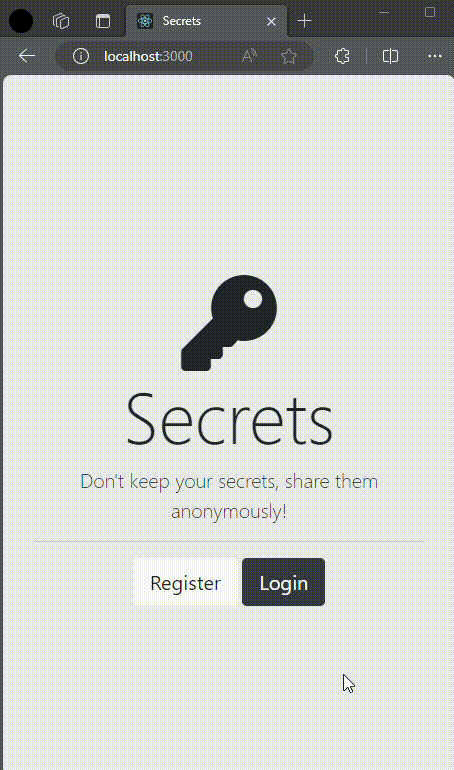

# ud3-app-with-auth

App with two auth methods through Passport library (Google Oauth & Encrypted auth persisted in postgreSQL database) made with Node.JS / Express / Passport / EJS / PostgreSQL. Studied from app brewery.

# Demo

